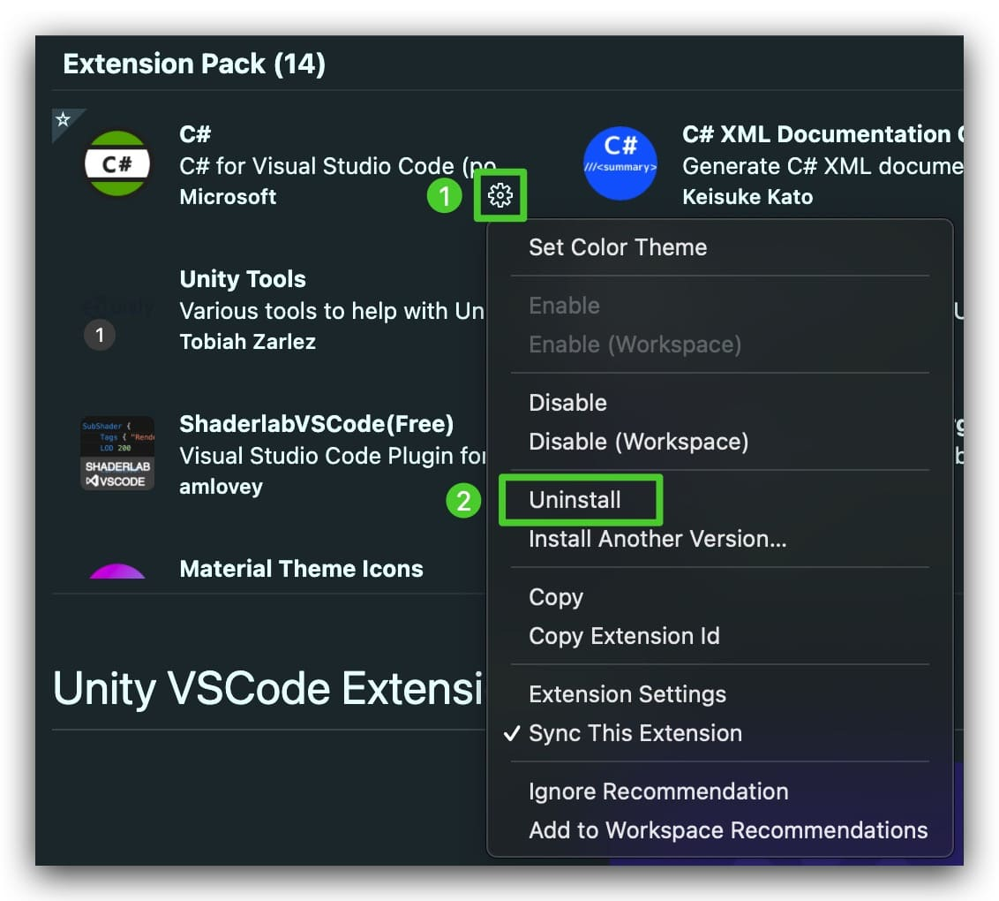

# Unity VSCode Extension Pack
## Tips
**You can uninstall the plugins that you don't need.**

## What contains

  

    <b>
      <samp>
        Extensions include
      </samp>
    </b>
  

### C# Support
- [C#](https://marketplace.visualstudio.com/items?itemName=ms-dotnettools.csharp) - C# Language support for VSCode.
- [C# XML Documentation Comments](https://marketplace.visualstudio.com/items?itemName=k--kato.docomment) - Generate XML documentation comments quickly.
- [Better Comments](https://marketplace.visualstudio.com/items?itemName=aaron-bond.better-comments)

### Unity Support
- [Debugger for Unity](https://marketplace.visualstudio.com/items?itemName=Unity.unity-debug) - Use this to debug your Unity C# projects.
- [Unity Tools](https://marketplace.visualstudio.com/items?itemName=Tobiah.unity-tools) - A tool to help Unity development, such as Search Unity API documentation.
- [Unity Code Snippets](https://marketplace.visualstudio.com/items?itemName=kleber-swf.unity-code-snippets) - Create code snippets of Unity APIs quickly.
- [Unity3D Meta Files Watcher](https://marketplace.visualstudio.com/items?itemName=PTD.vscode-unitymeta) - Change the meta file when file moves and file name changes.

### Shader Support
- [Shader languages support for VS Code](https://marketplace.visualstudio.com/items?itemName=slevesque.shader) - Shader Language support.
- [ShaderlabVSCode(Free)](https://marketplace.visualstudio.com/items?itemName=amlovey.shaderlabvscodefree) - Make it easily to write Unity ShaderLab.

### Git Support
- [GitLens — Git supercharged](https://marketplace.visualstudio.com/items?itemName=eamodio.gitlens) - Powerful visualize git extension.
- [Git History](https://marketplace.visualstudio.com/items?itemName=donjayamanne.githistory) - Visualize git log.

### Editor Appearance
- [Outer Heaven Theme](https://marketplace.visualstudio.com/items?itemName=Verbess.outer-heaven-theme)
- [Eva Theme](https://marketplace.visualstudio.com/items?itemName=fisheva.eva-theme)
- [Material Theme Icons](https://marketplace.visualstudio.com/items?itemName=Equinusocio.vsc-material-theme-icons)
- [Bracket Pair Colorizer 2](https://marketplace.visualstudio.com/items?itemName=CoenraadS.bracket-pair-colorizer-2) - Matching brackets to be identified with colors.

### Useful extension
- [Code Spell Checker](https://marketplace.visualstudio.com/items?itemName=streetsidesoftware.code-spell-checker) - Spell checker with camelCase code.
- [Todo Tree](https://marketplace.visualstudio.com/items?itemName=Gruntfuggly.todo-tree) - This can Highlight comments like TODO, FIXME and search these quickly. Let you get back to work quickly.
- [filesize](https://marketplace.visualstudio.com/items?itemName=mkxml.vscode-filesize) - Display the size of the focused file in the status bar of the editor.

## Credits
- [vijay verma](https://vijayverma.co/?ref=illlustrations) For Free Icon